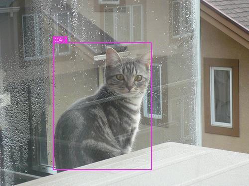
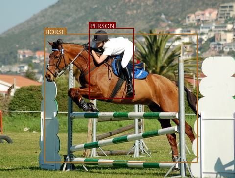
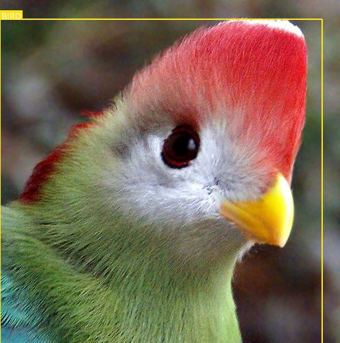

# object-detection-pytorch
SSD: Single Shot mutibox Detector

Codes are from [sgrvinod's repo](https://github.com/sgrvinod/a-PyTorch-Tutorial-to-Object-Detection).

He/She also adds excellent explaination of the concepts behind the model. Take a look!

I just amend little bit in my taste.

Reference
* [sgrvinod's repo](https://github.com/sgrvinod/a-PyTorch-Tutorial-to-Object-Detection)

### Some examples

---

---

---

---

